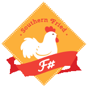

- title : Publish React Components with F#
- description : Southern Fried F# Talk - Publish React Components with Fable
- author : Eric Harding
- theme : night
- transition : default

***
<!-- theme: sky -->

## Publish React Components with Fable

> Eric Harding  
@digitalsorcery  
https://blog.digitalsorcery.net

<!-- 
BTS is a local company building tools for futures and options traders
use fable in production
SFF is a local meetup, come join us.
-->

***

## First, 
### a little background...

<!-- 
I'm going to be talking about several technologies
and I want to make sure everyone has, at least, a passing familiarity
 -->

---

## What is React?
- Component based JavaScript view library
- Pioneer of the pure view function

<!-- very popular -->

---

## What is F#?

<!--
We're about 7 talks into an F# conference...
I hope we're all on the same page about this by now
-->

---

## What is Babel?

- Babel is a JavaScript to JavaScript compiler (Wait, what?)
- Lets you use new JavaScript syntax on older browsers

<!--
Fable transforms the F# AST to the Babel AST
-->

--- 

## What is Fable?

- Fable is an F# to JavaScript compiler powered by [Babel](https://babeljs.io/)
- Fable is not **.NET** in the browser (see [Bolero](https://github.com/fsbolero/Bolero))
- Fable leverages the **JavaScript** ecosystem

<!-- 
Anything you can do with JavaScript you can do with F#
18 billion vs 11 billion
-->

---

> **Atwood's Law**:   
  any application that can be written in JavaScript, will eventually be written in JavaScript. 

---

## What is Elmish?
- Brings the MVU / [Elm](https://elm-lang.org/) programming model to F#
- The recommended _(but not only)_ way to build UI with Fable
  * Specifically: **Fable.Elmish.React**
- The **E** in [S.A.F.E](https://safe-stack.github.io/) stack
- Also used in [Fabulous](https://fsprojects.github.io/Fabulous/)

<!--
Why is it recommended? Because it's awesome.
-->

---

## What is NPM?
- The package manager for JavaScript
- [npmjs.com](http://npmjs.com) is the repository
- **Yarn** is an alternative front end

***

## OK, now what?

---
Oh, yea

---

Lets
## Publish React Components with Fable
- Create a React component
- Test it (hopefully?)
- Publish it on NPM

<!-- 
Fable is general purpose
Anything you can do with JavaScript you can also do with F#
-->

***

# But Why? 
- Is this a good idea?

<!-- 
I may be biased...
I think there are several reasons you might want to do this
-->

---

## Full Participation
- Fable 1.0 was released in [2017](https://fable.io/blog/Introducing-1-0-beta.html)
- Fable leverages JavaScript ecosystem to great effect
- Mostly a "read only" member of the larger JavaScript community

<!-- 
Fable is only a few years old
In those years the Fable community has built on top of high quality JavaScript packages like Babel and React
Fable packages are mostly for consumption by Fable but they don't have to be
 -->

---

## Try Before you Buy

- Elmish is amazing for green field work
- We don't always have that luxury

<!--
I wouldn't choose anything else for a green field web project
-->

---
## Low Risk
- Write a single component in F#
- Team doesn't even need Fable

  
> The secret to building large apps is never to build large apps. - *Justin Meyer*

<!--
Easy to justify
-->

---
## Spread F#
1. Publish something useful.
2. Wait for users to look at the source.
3. Some will learn enough to contribute back.

<!-- 
low key
JavaScript community may be more open to functional programming ideas than .NET
-->

***

# But How?

---

### I'm glad you asked.

---

## React in F#

    open Fable.React

    type Props = { name : string }

    type FSComponent(props : Props) as self =
        inherit PureComponent<Props,unit>(props) with
        do self.setInitState()
        override __.render() =
            div [] [
              str (sprintf "Hello %s" props.name)]

- Props & State
- Component / PureComponent
- render()
- HTML DSL 👌

<!-- 
- That's basically it
- Different namespaces in fable 2.x
- package.json
- webpack.config.js
-->

---

## App.js

    [lang=js]
    import React, { Component } from 'react';
    import { FSComponent } from 'fs-react-sample-component'
    class App extends Component {
      render() {
        return (
          

            <FSComponent name="from F#" />
          
);
      }
    }

---

### Publish to NPM

* yarn build
* yarn publish  
- or -
* npm run build
* npm publish

---

### Consume from NPM

> yarn add fs-react-sample-component   
   - or -  
   npm install --save fs-react-sample-component 

- Peer dependency on React

<!-- If you're already using react. You're done -->

---

### For Development

    [lang=bash]
    cd fs-react-sample-component
    npm link
    yarn start

    cd js-test
    npm link fs-react-sample-component
    yarn start

- Automatic reload across both projects

<!-- 
npm link sets up the local connection 
-->

---

### How Much Overhead?

    [lang=js]
    Asset      Size  Chunks             Chunk Names
    index.js  16.9 KiB       0  [emitted]  main
    Entrypoint main = index.js
    [0] external "react" 42 bytes {0} [built]
    [11] sample/src/fs-react-sample-component.fsproj + 9 modules 106 KiB {0} [built]
        | sample/src/sample.fsproj 27 bytes [built]
        | sample/src/index.fs 1.51 KiB [built]
        | sample/.fable/fable-library.2.2.3/Types.js 7.62 KiB [built]
        | sample/.fable/fable-library.2.2.3/Reflection.js 7.14 KiB [built]
        | sample/.fable/fable-library.2.2.3/String.js 16 KiB [built]
        | sample/.fable/fable-library.2.2.3/Util.js 17 KiB [built]
        | sample/.fable/fable-library.2.2.3/Long.js 34.6 KiB [built]
        | sample/.fable/fable-library.2.2.3/Date.js 14.3 KiB [built]
        | sample/.fable/fable-library.2.2.3/RegExp.js 3.56 KiB [built]
        | sample/.fable/fable-library.2.2.3/Int32.js 4.04 KiB [built]
        + 10 hidden modules
    Done in 14.64s.

### 17 KiB *before* gzip

<!--
Webpack gives a nice breakdown of what you use
-->

***

## What About Elmish?

---

### An Adapter

    open Fable.React

    type Props = { src : string option }
    let ImgSpinner props = 
        Adapter.toComponent 
            (fun p -> Counter.init p.src) Counter.update Counter.view props

- React and MVU 🤗  

<!--
Props is typically a set of fields
 -->

---

### Adapter.fs

    module Adapter
    open Fable.React

    type GenericComponent<'p,'s,'m>(
        init:'p->'s,update:'m->'s->'s,view,props) as self =
        inherit Component<'p,'s>(props) with
        do self.setInitState (init props)
        member __.update msg =
            let state' = update msg self.state
            self.setState (fun _ _ -> state')
        override __.render() =
            view self.state self.update

    let toComponent init update view props =
        GenericComponent(init,update,view,props)

---

# Demo

***

## Word of Warning

- This is not a well trodden path (yet)
- There may be bumps  🤜🤛
- The community is very helpful
- Find me on [F# Slack](https://fsharp.slack.com/)

--- 
# Questions?

---

## The End

- Slides at [https://github.com/ericharding/SouthernFriedReact](https://github.com/ericharding/SouthernFriedReact)
